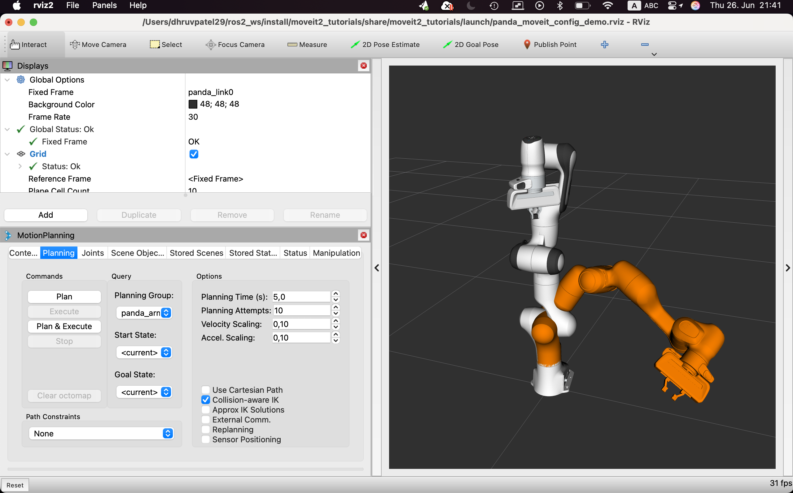

## 🤖 MoveIt 2 on macOS (Apple Silicon)

MoveIt 2 can be built on macOS (Apple Silicon) with a few extra steps.



MoveIt 2 is a powerful motion planning framework for ROS 2 that enables robot manipulation, collision checking, and kinematics.  
It provides tools and libraries to plan, execute, and visualize robot motions easily and efficiently, making it ideal for robotics research and development.

### ✅ Dependencies

```bash
brew install freeglut ompl
pip install ruckig==0.8.4
```
### 🏗️ Build Instructions
#### 1. Build required perception packages first:
Build the required perception packages from ros-perception first:
```bash
colcon build --base-paths src/ros-perception/ --symlink-install \
  --cmake-args -DCMAKE_BUILD_TYPE=Release -DBUILD_TESTING=Off \
  --executor parallel \
  --parallel-workers $(sysctl -n hw.ncpu)
```
#### 2. Build OpenMP-dependent MoveIt packages with LLVM
Apple’s default Clang does not support OpenMP. For the following packages, install LLVM and set environment variables before building:
  - moveit_ros_perception
  - moveit_planners_ompl

Set up LLVM and environment variables:

```bash
brew install llvm libomp

export PATH="/opt/homebrew/opt/llvm/bin:$PATH"
export LDFLAGS="-L/opt/homebrew/opt/llvm/lib"
export CPPFLAGS="-I/opt/homebrew/opt/llvm/include"
export CC=/opt/homebrew/opt/llvm/bin/clang
export CXX=/opt/homebrew/opt/llvm/bin/clang++
```
```bash
colcon build --packages-select moveit_ros_perception moveit_planners_ompl --symlink-install \
  --cmake-args -DCMAKE_BUILD_TYPE=Release -DBUILD_TESTING=Off \
  --executor parallel \
  --parallel-workers $(sysctl -n hw.ncpu)
```
> **Important**: After building these two packages, **restart your terminal** to reset to the default Apple Clang compiler before building the remaining packages.

#### 3. Build the rest of the MoveIt packages:
```bash
colcon build --base-paths src/moveit/ --symlink-install \
  --cmake-args -DCMAKE_BUILD_TYPE=Release -DBUILD_TESTING=Off \
  --executor parallel \
  --parallel-workers $(sysctl -n hw.ncpu)
```
### 4. Test Moveit with MoveIt2_tutorials

To test that your MoveIt installation works correctly, clone the [MoveIt2 Tutorials](https://github.com/moveit/moveit2_tutorials.git) repository:

#### 1. Clone the Repo
```bash
cd ~/moveit_ws/src
git clone https://github.com/moveit/moveit2_tutorials.git -b humble
```

#### 2. Build MoveIt2 Tutorials
```bash
cd ~/ros2_ws
colcon build --packages-select moveit2_tutorials --symlink-install
```

#### 3. ⚠️ macOS-Specific: Preload Capability Library

Before running the tutorials on macOS, you must preload the MoveIt capabilities plugin manually:

```bash
export DYLD_INSERT_LIBRARIES=$HOME/humble-ros2/install/moveit_ros_move_group/lib/libmoveit_move_group_default_capabilities.dylib
```
#### 4. Launch MoveIt Tutorials
```bash
ros2 launch moveit2_tutorials demo.launch.py
```

